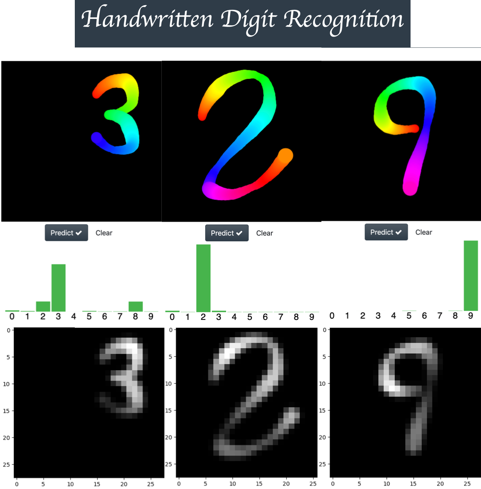
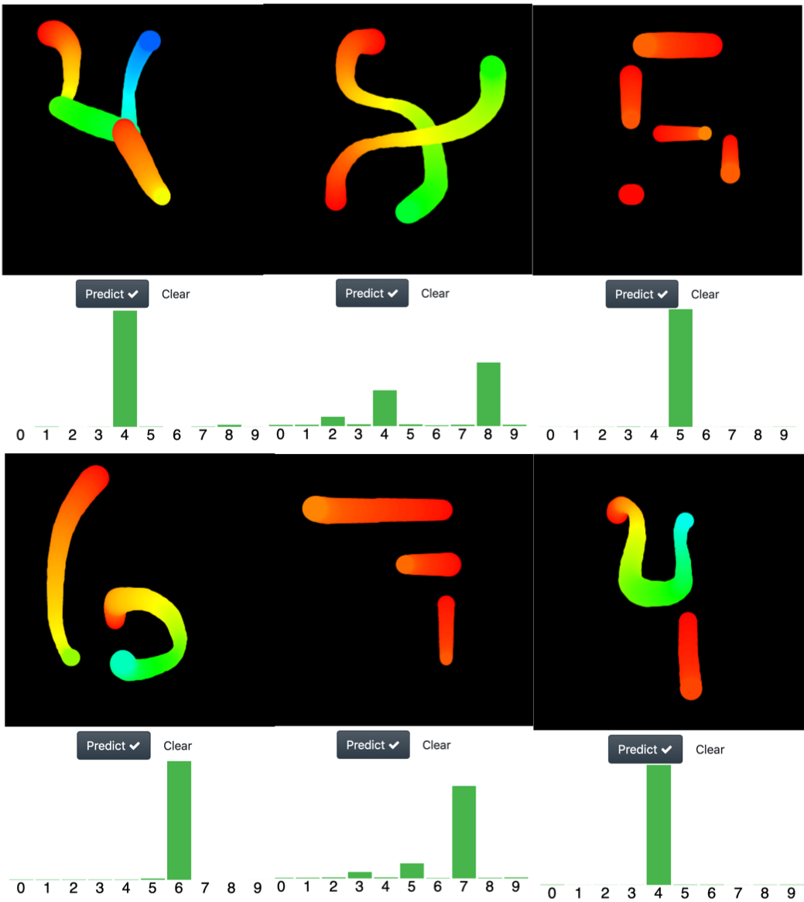
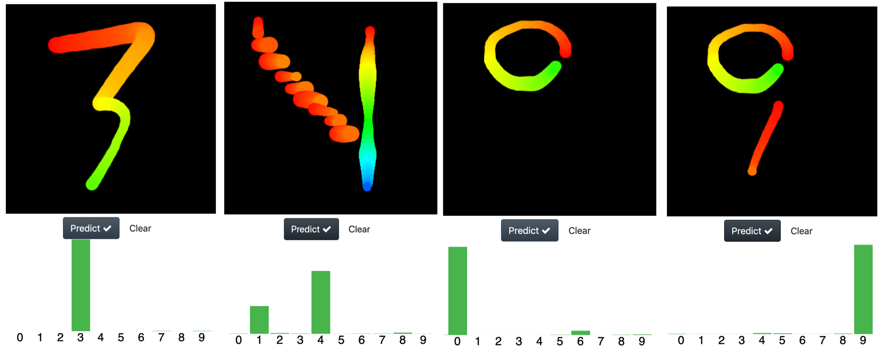
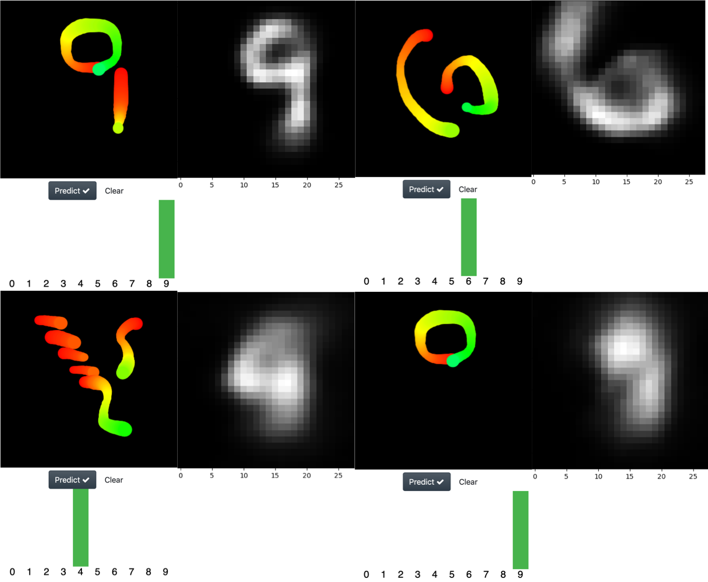

# Handwritten Digit Recognition Challenge




Table of contents
=================
<!--ts-->
   * [Motivation](#Motivation)
   * [Nets implemented in this repo](#Nets-implemented-in-this-repo)
   * [Inverse image decoding with the capsule network](#Inverse-image-decoding-with-the-capsule-network)
   * [Installation](#installation)
   * [Usage](#usage)
   * [Add your own models](#Add-your-own-models)
      * [Run your own models saved as pickle files](#Run-your-own-models-saved-as-pickle-files)
      * [Run your own models saved as pytorch .pth files](#Run-your-own-models-saved-as-pytorch-.pth-files)
   * [To do list](#To-do-list)
   * [Credits](#credits)
   * [Support](#support)

<!--te-->


Motivation
============


The motivation behind this project is search for realible neural network architectures (trained with the MNIST dataset) for handwritten digit recognition under adverse conditions 
(with a pen tip that changes its size and color during the drawing process) in a fun way (yeah drawing is relaxing and fun).


Particularly I'm interested in building and test differents architectures for the capsule network (which is one of the networks avaible to playaround in this code) and maybe motivate others to participate in coding capsule networks and test them using their drawing skills and this code.

Quoting the original  <a href="https://arxiv.org/pdf/1710.09829.pdf"> paper </a> of capsule networks

```
There are many possible ways to implement the general idea of capsules. The aim of this paper is not
to explore this whole space but simply to show that one fairly straightforward implementation works
well and that dynamic routing helps
```

So, for anyone interested, you can build a slightly variants of the capsule net and see how your networks perfom using this app (which could be more fun than using the mniset again, where we already know the capsule net performs very well)

As you can see in the figure above, the width and color changes as a digit is drawn and cold colors (like blue) generate low intensity strokes, (you can see this when the images are converted into MNIST type images). So this app is a good way to challenge the true performance of any cnn and you can test them locally in your computer if you want.

**Interesting results:**

As humans we tend to associate any shape to a familiar concept, for example you can see a smiling face just here ( = ) ). So I tested if the networks that I trained for this code share this ability of recognize abstract representations of a digit. 

At difference with the pathological cases of the MNIST set (where some digits are unrecognizable with its associated labels for any human being), I decided to test if the the networks are capable to recognized the "abstract" idea of a certain digit, under the condition that its representation should be easily recognized by any human. In the image below I represent the following numbers: 

* row1:      4  8   5 
* row2:      6   7   4 



I was amazed with the great performance of the nets, so I pushed them a bit further in its ability to recognize an abstract representation of a digit with the following images.



Particularly a challenging one was the  digit "4". I drew it as descending stairs from heaven with a rainbow waterfall at the background (yeah all that is there, you can see it? :blush:  :roll_eyes: :expressionless:) and the net can do it very well, it choose the number 4 but it also get doubts and give it a chance  (with a certain probability) to the number 1 (a very reasonable choice).


Nets implemented in this repo
============

* Resnet-ish. A pure convolutional neural network coded by <a href="https://twitter.com/jeremyphoward?lang=es"/> Jeremy Howard</a> in this <a href="https://github.com/fastai/course-v3/blob/master/nbs/dl1/lesson7-resnet-mnist.ipynb"/> notebook </a>
* Lenet-like. A neural network based on the lenet5 arcchitecture coded by Chris Deotte in <a href="https://www.kaggle.com/cdeotte/25-million-images-0-99757-mnist/notebook">this kaggle kernel</a> , (I code only one of the fifteen CNNs that are originally proposed)
* The "Capsule net", the capsule net is a very cool and clever idea which make used of  spatial information contained inside the image to improve its performance. Indeed I found the capsule net amazing because for me the idea behind the routing agreement slgorithm looks very similar to the idea behind the determination of eigenstates in quantum physics. I use <a href="https://github.com/gram-ai/capsule-networks">this </a> GitHub repo as a reference to build the network


Inverse image decoding with the capsule network
============
Another cool feature of the capsule net, is that it works like an inverse image decoder, so it's possible extract the image that the neural net "think" it is seen. Below I show interesting examples of this. 



In the last case, the net missclasify the zero drew at the top of the portrait and reconstructs the digit 'nine'.


Installation
============

I recommed you to use anaconda to create a virtual environment and do the installation there.

````bash
conda create --name mnist-app python=3.7
source activate mnist-app
pip install -r requirements.txt
````

Usage
============

To deploy the app using a particular neural network architecture please type:

```bash
python app/server.py serve model_name
```

where ```model_name``` is the name of one of the supported models for this app. In the app folder, find the file called 
"avaible_models.txt" to find the names of the avaible models. For your comodity I listed all the avaible models, so you can copy and paste these commnads to run the app
````bash
python app/server.py serve caps-net
python app/server.py serve resnet-ish
python app/server.py serve lenet-like
````
Once the app is running, paste the following direction in your favorite web browser (I only tested the app in safari and chrome).

````
http://0.0.0.0:5042
````

Also you can create and add easily your models. Right now, this code only support models written with pytorch

Add your own models
============

Use the add_model.py to add your models easily typing: 

````bash
python app/add_model.py model_name url

or

python app/add_model.py model_name none
````

Here ```model_name``` is the name you want to use for your model
If you have stored your model in google drive or dropbox you can pass its url as second argument to downloaded it.
**Note** the url should be a direct download link not the share link (which is the first option provided). To transform your share link to a direct download link please use:

Google Drive: Use this <a href="https://www.wonderplugin.com/online-tools/google-drive-direct-link-generator/"/>link</a> generator.
Dropbox: Use this link generator <a href=>https://syncwithtech.blogspot.com/p/direct-download-link-generator.html</a>

If you don't provided a url as second argument, you must pass the word none and you must place manually your .pkl or .pth file
to the directory called ```models```

Run your own models saved as pickle files
============

Once you added your model to the list, you can simply type 

````bash
python app/server.py serve model_name
````
Sometimes, we you save your model as a pickle file, the following warning can be raised:
```python
UserWarning: Couldn't retrieve source code for container of type CapsuleNet. It won't be checked for correctness upon loading.UserWarning: Couldn't retrieve source code for container of type CapsuleNet. It won't be checked for correctness upon loading.
```
The above happens a loot if your network is compossed of different functions and classes. In that case it's better that you save your model as a .pth file

Run your own models saved as pytorch .pth files
============

In this case you must do two things. 

* add your model to the list and provide the url or move manually the .pth file to the models dirrectory
* you must create a model_name.py and copy the code of the exact architecture you used to create a .pth file, and at the end of the
file you must deffine the following function

``` python
def return_model(): 
  return CapsuleNet()
```

It's very important that the .py file has the same name that the .pth file, if they are different, yoou will get an error message.

Use the file caps-net.py as an example

To do list
============

In the future I want to add functionality to the app to build internally a database with the drew images and pass them to all the architectures available to test which truly is the best performer. This is an interesting and challenging feature because it's important design an automated system that avoid misclassification of the images but allowing to the user be part of the classification process.


Credits
============

* The original code for the neural networks is cited in the section "Nets implemented in this repo"
* The code for the starlette server was adapted from: https://github.com/render-examples/fastai-v3
* The code for the d3.js was adaptded from https://github.com/rhammell/mnist-draw


# Support
:blush:[](https://paypal.me/edcommerce?locale.x=es_XC) :roll_eyes: 
